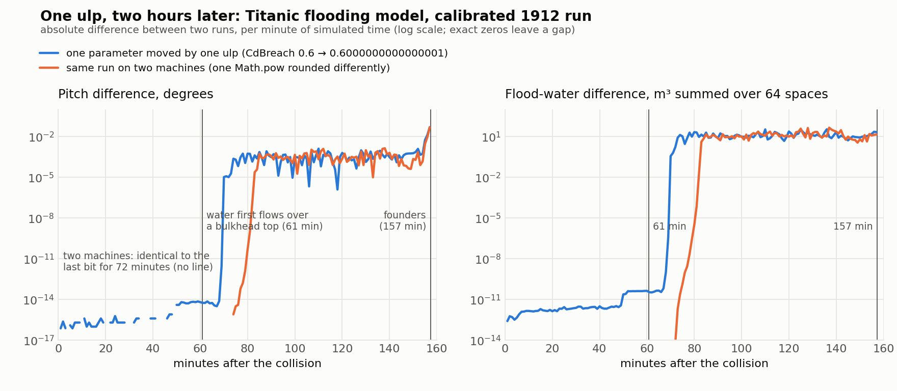
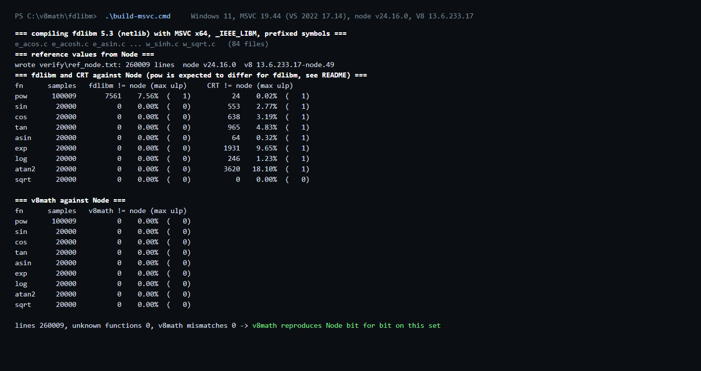

# v8math

**Bit-exact Node.js / V8 `Math.*` for C++ ports.** netlib fdlibm 5.3 as a prefixed-symbol CMake package,
V8's `Math.pow` semantics in a forty-line header, and a harness that proves the combination against the
Node binary on your machine.

<picture>
  <source media="(prefers-color-scheme: dark)" srcset="docs/divergence-dark.png">
  
</picture>

*A flooding simulation of RMS Titanic, run twice: as published, and with one parameter moved by a single
ulp. The two runs are identical to the last bit for an hour of simulated time, then threshold events
amplify the difference by ten orders of magnitude. "Match the JavaScript to 1e-6" is not a meaningful
target for a port unless the C++ gets the same bits.*

## The short version

`<cmath>` is not Node's `Math`. Measured on Windows 11 with MSVC 19.44 against 260,009 samples taken from
Node v24.16.0 (V8 13.6.233.17):

| function | fdlibm vs Node | MSVC CRT vs Node | `v8math` vs Node |
|---|---|---|---|
| pow | 7.56 % differ | 0.02 % differ, all `y == 2` | **0** |
| sin | 0 | 2.77 % | **0** |
| cos | 0 | 3.19 % | **0** |
| tan | 0 | 4.83 % | **0** |
| asin | 0 | 0.32 % | **0** |
| exp | 0 | 9.65 % | **0** |
| log | 0 | 1.23 % | **0** |
| atan2 | 0 | 18.10 % | **0** |
| sqrt | 0 | 0 | **0** |

Every difference is one ulp. The pattern has a simple explanation, with the V8 source in
[`reference/`](reference/v8-13.6-node-24.16/NOTES.md):

- **Trigonometric, exponential and logarithmic functions.** V8 carries its own port of fdlibm
  (`src/base/ieee754.cc`) and uses it on every platform. Link fdlibm and you get Node's bits on any OS.
- **`Math.pow` is the odd one out.** V8 13.6 dispatches through `v8::internal::math::pow`
  (`src/numbers/ieee754.cc`). With `v8_flags.use_std_math_pow`, default `true` (`flag-definitions.h`
  line 1029), it applies the ECMAScript special cases, folds `y == 2` to `x * x` and `y == 0.5` to
  `sqrt(x + 0)`, and otherwise calls **the platform CRT's `std::pow`**. Only with the flag off does it fall
  back to `base::ieee754::legacy::pow`, the fdlibm port. So `Math.pow` depends on the C runtime your Node
  links, the UCRT on Windows and glibc on Linux, and on the V8 version. Two machines can disagree on the
  last bit of the same script. On Windows it goes one step further: `node.exe` carries its own static
  copy of the UCRT, and the system `ucrtbase.dll` disagrees with it on 33 of 100,009 `pow` samples, so a
  C++ build that links the dynamic CRT matches Node on `sin` and never quite on `pow`.
- The 24 CRT mismatches are all `y == 2`: the UCRT's `pow(x, 2)` is not always the correctly rounded
  square that `x * x` is.
- `sqrt` is correctly rounded by IEEE 754 everywhere.

`v8math` therefore routes `sin`, `cos`, `tan`, `asin`, `atan2`, `exp` and `log` to fdlibm and implements
`pow` exactly as V8 does, over `std::pow`.

## Use it

```cmake
add_subdirectory(v8math)        # or find_package(v8math CONFIG REQUIRED) after cmake --install
target_link_libraries(engine PRIVATE v8math::v8math)
```

```cpp
#include <v8math/v8_math.hpp>

double w = 1 - v8math::pow(u, n);   // Node's Math.pow on this platform
double s = v8math::sin(theta);      // Node's Math.sin on every platform
```

Compile the code that calls it with `/fp:strict` or `/fp:precise` (MSVC) or `-ffp-contract=off` (GCC and
Clang). Never fast-math: it may send `std::pow` to a vector library and contract `a*b+c` into a fused
multiply-add, and the JavaScript engine does neither. On Windows, link the C runtime statically (`/MT`,
or `CMAKE_MSVC_RUNTIME_LIBRARY=MultiThreaded`) when `pow` has to match `node.exe`; the reason is under
verification below.

fdlibm on its own: link `fdlibm::fdlibm`, include `<fdlibm_api.h>` and call `fdlibm_sin(x)` and friends.
Every public symbol carries the `fdlibm_` prefix, so the library sits next to the CRT without clashes
and you can choose per call site. The sources in `fdlibm/src/` are the untouched netlib files; the
prefixing is done by a force-included header (`fdlibm/fdlibm_rename.h`), and the build defines
`_IEEE_LIBM` and `__LITTLE_ENDIAN`.

## Verify on your machine

Trust the harness, not this README. The reference is sampled from the Node that runs the test, so the
result reflects your platform, your Node and your compiler.

```bash
cmake -S . -B build
cmake --build build --config Release
ctest --test-dir build -C Release --output-on-failure
```

`v8math.gen_ref` writes 260,009 samples with the `node` on your PATH and `v8math.verify` must match them
bit for bit. On Windows, `fdlibm\build-msvc.cmd` does the same with plain `cl` and also writes the
fdlibm-versus-CRT table (`fdlibm/verify/result_*_msvc_x64.txt`).



**Windows CRT linkage matters.** `node.exe` imports no UCRT DLL: it links the C runtime statically. The
harness built with the static runtime (`/MT`, the default when this project is built on its own) matches
Node on every sample. The same source built against the dynamic runtime (`/MD`, the system
`ucrtbase.dll`) differs on 33 `pow` samples, all with non-integer exponents, each by one ulp. If you
consume `v8math` from an `/MD` build, expect the `pow` row to read about 0.03 % on Windows, or switch the
runtime. The static `libucrt.lib` also comes from a particular Windows SDK; the one here (10.0.26100)
matches the build of Node 24.16. Another SDK may not, and the harness will say so.

What to expect elsewhere:

- **Linux and macOS.** The fdlibm rows should stay at zero, since V8 runs the same code there. The `pow`
  row should also stay at zero because `v8math::pow` calls the same `std::pow` that Node calls, but this
  has only been measured on Windows. An issue with your `ctest` output is welcome.
- **Older Node.** Before `use_std_math_pow`, `Math.pow` was fdlibm's. The `pow` row then reports
  mismatches, and `fdlibm_pow` is the function you want instead. The harness tells you which.
- **V8 built with `V8_USE_LIBM_TRIG_FUNCTIONS`.** V8 can be built to use glibc-derived `sin` and `cos`
  instead of fdlibm's. Node is not (see `reference/v8-13.6-node-24.16/NOTES.md`).

The sample domains are those of the flooding model below (`fdlibm/verify/gen_ref.js`); change them in
one place if your model lives elsewhere on the number line.

## The motivating case

The model is a flooding simulation of RMS Titanic: 4,408 hull columns, 64 flooded spaces, 290 flow paths
with orifice and weir laws, a damped rigid body in heave, pitch and roll, a 0.25 s step, about 9,440
steps to foundering. Its JavaScript core is the oracle for a C++/CUDA port, and the port is supposed to
reproduce it bit for bit.

Two things were measured before writing any C++ (`examples/titanic-divergence/`):

| | shipped golden trace vs local regeneration | one-ulp nudge of one parameter |
|---|---|---|
| cause | one `Math.pow` in the hull-form function rounded differently by two C runtimes | `CdBreach` 0.6 moved by 2⁻⁵² |
| bit-identical until | 72 min | 1 min, then 1e-15 noise |
| visible divergence from | 80 to 90 min | 60 to 70 min |
| largest event shift | 24 s, bulkhead A overtopped | 10 s, bulkhead G overtopped |
| final pitch difference | 0.05° | 0.05° |
| foundering time | identical, 9440.5 s | identical |

The amplification starts when the first water flows over a bulkhead top and port and starboard halves of
a space merge: a flow that switches on one step earlier or later is a discontinuity, and the model is
chaotic from there. The outcome is robust, the trajectory is not, and a whole-run comparison between the
port and the oracle only means something if the two start from the same bits.


*The model's viewer, 154 minutes after the collision. The model, the viewer and the port live in the
companion `sinksim` project.*

## CUDA

The device has no UCRT `pow`, and its `sin`, `cos` and `pow` are not bit-identical to fdlibm. Two ways
out: keep the CPU build as the oracle match and compare the GPU with tolerances, or compile the fdlibm
sources as `__device__` functions (plain C; build with `-fmad=false`) and call `fdlibm_pow` on both CPU and
GPU, so the two agree bit for bit with each other while a per-step check against the oracle absorbs the
one-ulp `pow` difference.

## Layout

```
include/v8math/v8_math.hpp        the header: v8math::pow/sin/cos/tan/asin/atan2/exp/log/sqrt
fdlibm/                           netlib fdlibm 5.3 as a CMake package (fdlibm::fdlibm)
  src/                            the 84 netlib files, unmodified
  fdlibm_rename.h, fdlibm_api.h   symbol prefixing and the public prototypes
  build-msvc.cmd                  plain-cl build plus both harnesses on Windows
  verify/                         gen_ref.js, verify_fdlibm.c, verify_v8math.cpp, measured results
reference/v8-13.6-node-24.16/     the V8 sources the claims above are made from, with NOTES.md
examples/titanic-divergence/      the divergence measurement, both golden traces, the figure script
docs/                             figures
```

## Licenses

- This repository: MIT (`LICENSE`).
- fdlibm: Sun Microsystems, "permission to use, copy, modify, and distribute this software is freely
  granted, provided that this notice is preserved" (`fdlibm/LICENSE`, and the header of every source file).
- V8 reference files: BSD-3-Clause (`reference/v8-13.6-node-24.16/LICENSE`).
